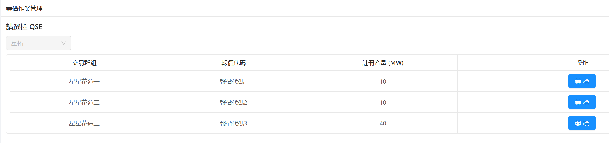
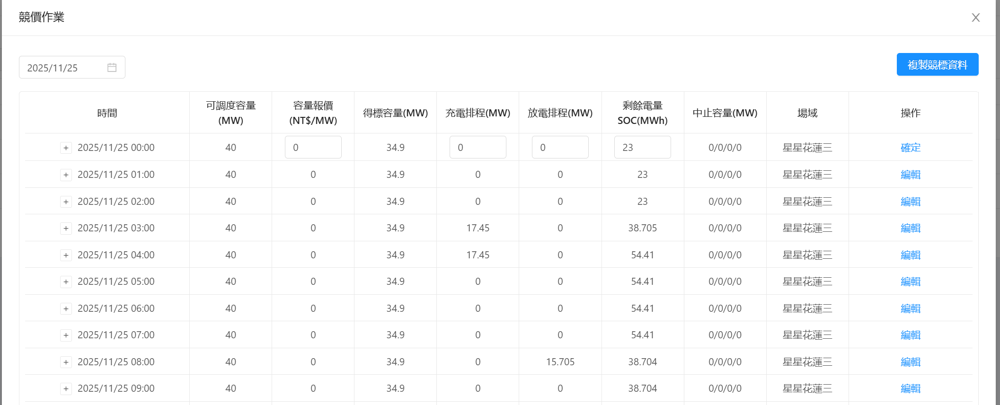

# [MR市場管理]MR001競價作業

<aside>
🗂️

文件資訊（作者／版本／日期）

- 作者：@Cathy.Wu 吳怡慧
- 版本：v1.0
- 日期：2025/11/25
</aside>

## 競價作業功能介面
- 主功能介面: 該登入帳號可查詢的交易群組基本資料清單
- 子功能介面: 選擇交易群組後，可看到每日E-dreg報價與得標資料
- 可操作功能鈕:
	- 報價匯入
	- 得標匯入
	- 中止待命匯入
	- 報價資料匯出
	- 單筆資料編輯的功能鈕 : 編輯、確定、更新

## 主功能介面

1. 顯示該登入帳號可查閱的QSE下拉清單
	- 系統管理員可看到全QSE
	- 單一QSE帳號只能看到自己報價代碼下的QSE
2. 資料清單區，顯示欄位:
	- 交易群組
	- 報價代碼
	- 註冊容量
	- 操作: 點選後，進入子功能介面

## 子功能介面

顯示指定日期下每個小時的
- 報價資料: (由報價匯入功能產生，操作人員可提前匯入2週後的資料)
	- 可調度容量(MW)
	- 容量報價(NT$/MW)
- 得標資料: (由得標匯入產生，操作人員收到台電得標資料後匯入，1日一次)
	- 得標容量(MW)
	- 充電排程(MW)
	- 放電排程(MW)
	- 剩餘電量SOC(MWh)
- 中止容量(MW)，現行少用，可再討論用途
- 場域

## 可操作功能鈕

### 報價匯入
- 使用頻率 : 視作業人員習慣，可預先匯入。
- 操作流程 : 於自己電腦編輯完要上傳的Excel檔，再點選報價匯入，將檔案上傳上去。
- 檔案來源 : 可於[台電電力交易平台]報價作業>報價資料上傳，下載報價範例檔案
- 實際產生檔案 :
 [星星花蓮三 1116~1206.csv](../MR001/4-2_1116~1206.csv) 

- 台電作業規範可同時填報30日的報價資料
- 目前此處的報價資料與台電電力交易平台的是脫鉤的。作業人員需要兩邊操作。 若報價檔案可以由台電匯入後取得，則此功能可以討論是否還需要存在。

### 得標匯入
- 使用頻率 : 每日(工作日)；每日台電會在16:00、17:00、18:00(每日不一定)時提供明日的得標資料。 台電提供後，即可透過此功能匯入系統。
- 操作流程 : 下載台電得標結果，將檔案匯入系統。
- 檔案來源 : [台電電力交易平台] 公告作業 > 得標結果查詢，匯出csv檔案。
- 注意事項 : 目前此功能在匯入時，會影響案場的充放電排程，故不能當日匯入當日得標資料。目前作業人員會前一日匯入，來不及就後一天再匯入。

### 中止待命匯入
todo: 目前少用，實作時再討論一下此功能目標。

### 報價資料匯出
匯出特定日期的報價資料，欄位類似**得標匯入**
實際產生檔案:
[TXG-HD000-03-2025_11_12.csv](../MR001/TXG-HD000-03-2025_11_12.csv) 

### 單筆資料編輯鈕

若匯入的資料想要單筆修改
1. 可在該條資料的操作處，點選 **編輯** (此時編輯會轉為 **確認** 鈕)
2. 資料的格子會改成可編輯的格子，在格子內填寫完要修改得內容後，按下 **確認**
3. 若有多條資料要修改，則重複 1. & 2. 的步驟
4. 所有資料編輯完後則點選 **更新** 鈕