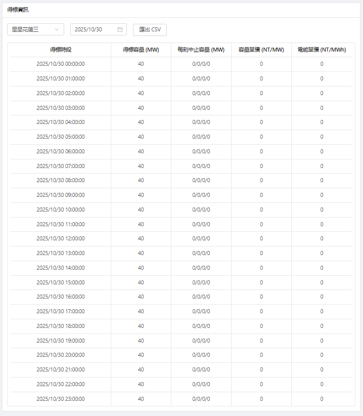

# [PE服務績效]PE002得標資訊

  

<aside>
🗂️
文件資訊（作者／版本／日期）

- 作者：@Cathy.Wu 吳怡慧
- 版本：v1.0
- 日期：2025/11/10
</aside>

## 得標資訊介面
- 選單
	- 交易群組下拉清單，可切換該登入帳號可查看的交易群組
	- 日期選單，可查詢所有過往得標資訊
		- 需制定資料留存期限，ex: 3年前資料封存到指定主機目錄，未來真的有查詢需求可找到資料
- 匯出csv功能鈕
- 得標資訊列表，包含欄位:
	- 得標時段
	- 得標容量(MW)
	- 每刻終止容量(MW)
	- 容量單價(NT/MW)
	- 電能單價(NT/MWh)

## 匯出csv
將得標資料匯出，目前實際產出檔案:
[得標資訊_星星花蓮三_2025-11-05.csv](/PE002/得標資訊_星星花蓮三_2025-11-05.csv) 
請注意匯出時的檔名，應可辨識匯出的交易群組與日期。